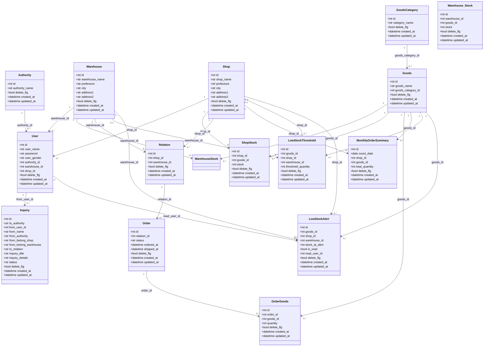

# クラス図

```mermaid
classDiagram
    class Authority {
        +int id
        +str authority_name
        +bool delete_flg
        +datetime created_at
        +datetime updated_at
    }

    class User {
        +int id
        +str user_name
        +str password
        +str user_gender
        +int authority_id
        +int warehouse_id
        +int shop_id
        +bool delete_flg
        +datetime created_at
        +datetime updated_at
    }

    class Warehouse {
        +int id
        +str warehouse_name
        +str prefecture
        +str city
        +str address1
        +str address2
        +bool delete_flg
        +datetime created_at
        +datetime updated_at
    }

    class Shop {
        +int id
        +str shop_name
        +str prefecture
        +str city
        +str address1
        +str address2
        +bool delete_flg
        +datetime created_at
        +datetime updated_at
    }

    class GoodsCategory {
        +int id
        +str category_name
        +bool delete_flg
        +datetime created_at
        +datetime updated_at
    }

    class Goods {
        +int id
        +str goods_name
        +int goods_category_id
        +bool delete_flg
        +datetime created_at
        +datetime updated_at
    }

    class Warehouse_Stock {
        +int id
        +int warehouse_id
        +int goods_id
        +int stock
        +bool delete_flg
        +datetime created_at
        +datetime updated_at
    }

    class ShopStock {
        +int id
        +int shop_id
        +int goods_id
        +int stock
        +bool delete_flg
        +datetime created_at
        +datetime updated_at
    }

    class Relation {
        +int id
        +int shop_id
        +int warehouse_id
        +bool delete_flg
        +datetime created_at
        +datetime updated_at
    }

    class Order {
        +int id
        +int relation_id
        +str status
        +datetime ordered_at
        +datetime shipped_at
        +bool delete_flg
        +datetime created_at
        +datetime updated_at
    }

    class OrderGoods {
        +int id
        +int order_id
        +int goods_id
        +int quantity
        +bool delete_flg
        +datetime created_at
        +datetime updated_at
    }

    class MonthlyOrderSummary {
        +int id
        +date count_date
        +int shop_id
        +int goods_id
        +int total_quantity
        +bool delete_flg
        +datetime created_at
        +datetime updated_at
    }

    class Inquiry {
        +int id
        +str to_authority
        +int from_user_id
        +str from_name
        +str from_authority
        +str from_belong_shop
        +str from_belong_warehouse
        +str to_relation
        +str inquiry_title
        +str inquiry_details
        +str status
        +bool delete_flg
        +datetime created_at
        +datetime updated_at
    }

    class LowStockThreshold {
        +int id
        +int goods_id
        +int shop_id
        +int warehouse_id
        +int threshold_quantity
        +bool delete_flg
        +datetime created_at
        +datetime updated_at
    }

    class LowStockAlert {
        +int id
        +int goods_id
        +int shop_id
        +int warehouse_id
        +int stock_at_alert
        +bool is_read
        +int read_user_id
        +bool delete_flg
        +datetime created_at
        +datetime updated_at
    }

    %% 既存の関係
    Authority "1" --> "0..*" User : authority_id
    Warehouse "1" --> "0..*" User : warehouse_id
    Shop "1" --> "0..*" User : shop_id
    GoodsCategory "1" --> "0..*" Goods : goods_category_id
    Warehouse "1" --> "0..*" WarehouseStock : warehouse_id
    Goods "1" --> "0..*" WarehouseStock : goods_id
    Shop "1" --> "0..*" ShopStock : shop_id
    Goods "1" --> "0..*" ShopStock : goods_id
    Shop "1" --> "0..*" Relation : shop_id
    Warehouse "1" --> "0..*" Relation : warehouse_id
    Relation "1" --> "0..*" Order : relation_id
    Order "1" --> "0..*" OrderGoods : order_id
    Goods "1" --> "0..*" OrderGoods : goods_id
    Shop "1" --> "0..*" MonthlyOrderSummary : shop_id
    Goods "1" --> "0..*" MonthlyOrderSummary : goods_id
    User "1" --> "0..*" Inquiry : from_user_id

    %% 低在庫アラート機能（新規）
    Goods "1" --> "0..*" LowStockThreshold : goods_id
    Shop "0..1" --> "0..*" LowStockThreshold : shop_id
    Warehouse "0..1" --> "0..*" LowStockThreshold : warehouse_id
    Goods "1" --> "0..*" LowStockAlert : goods_id
    Shop "0..1" --> "0..*" LowStockAlert : shop_id
    Warehouse "0..1" --> "0..*" LowStockAlert : warehouse_id
    User "0..1" --> "0..*" LowStockAlert : read_user_id
```
